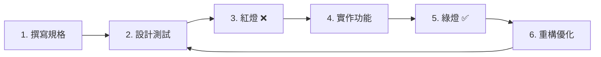

# 📘 SDD 開發技術 - AI 時代實戰專案說明

## 🎯 專案概覽

本教材提供從**規格驅動開發 (SDD)** 理論到實戰的完整學習路徑，專為**非軟體工程師**設計，聚焦 **AI 時代的實際應用**。

### 1. 📖 理論教材

完整的 SDD 學習大綱，包含：
- ✅ **模組 0**：規格驅動思維
- ✅ **模組 1**：開發者工具包（Google Colab 優先）
- 🔄 **模組 2**：SDD 核心循環實戰
- 🏗️ **模組 3**：軟體架構入門
- 🤖 **模組 4**：進階 AI 協作

### 2. 💻 實戰專案：AI 應用開發

三個漸進式的 AI 應用專案：
- 🎨 **風格特徵提取器**（基礎）- 資料處理與分析
- 📰 **新聞轉教案生成器**（進階）- AI API 整合
- 📚 **個人知識庫管理器**（綜合）- 完整應用開發

---

## 📁 專案結構

```
SDD-learning-guide-main/
├── 模組內容/                      # 📖 理論教材
│   ├── 模組0_規格驅動思維.md
│   ├── 模組1_開發者工具包.md
│   └── ...
│
└── sdd-practice-project/          # 💻 實戰專案
    ├── style-analyzer/            # 🎨 專案1：風格特徵提取器
    │   ├── README.md
    │   ├── specs/                 # 規格文件
    │   ├── notebooks/             # Colab Notebooks
    │   └── src/                   # Python 程式碼
    │
    ├── news-to-lesson/            # 📰 專案2：新聞轉教案
    │   ├── README.md
    │   ├── specs/
    │   ├── notebooks/
    │   └── src/
    │
    └── knowledge-base/            # 📚 專案3：知識庫管理器
        ├── README.md
        ├── specs/
        ├── notebooks/
        └── src/
```

---

## 🚀 立即開始

### 方案 A：學習理論（推薦先讀）

```bash
# 閱讀核心模組
1. 模組 0：規格驅動思維（30-60 分鐘）
2. 模組 1：開發者工具包（60-120 分鐘）
3. 選擇實戰專案開始實作
```

### 方案 B：Google Colab 快速體驗

```
1. 開啟專案的 Colab Notebook
2. 點擊「在 Colab 中開啟」
3. 跟著步驟執行程式碼
4. 立即看到結果
```

**優勢**：
- ✅ 無需安裝任何軟體
- ✅ 雲端執行，免費 GPU
- ✅ 即時互動學習
- ✅ 容易分享和協作

---

## 🎨 專案 1：風格特徵提取器

### 📋 專案目標
從文字內容（文章、逐字稿、投影片）中提取個人風格特徵，生成 JSON 格式的風格報告。

### 🎯 學習重點
- 資料處理基礎
- JSON 格式規格
- NLP 工具使用（spaCy, NLTK）
- 情感分析入門

### 📊 功能範圍
```
輸入：文字檔案（.txt, .md）
處理：
  - 情感分析（熱情度得分）
  - 句子長度統計
  - 高頻短語提取
  - 問句比例計算
輸出：JSON 格式風格報告
```

### 🔧 技術棧
- Python 3.x
- Google Colab
- spaCy / NLTK
- VADER Sentiment

### 📚 涵蓋主題
- ✅ 檔案讀取與處理
- ✅ 文字分析
- ✅ 資料結構（JSON）
- ✅ 測試驅動開發
- ✅ 規格驗收

---

## 📰 專案 2：新聞轉教案生成器

### 📋 專案目標
將新聞文章轉換為結構化教學內容，支援多受眾適配（企業高管、成人學員、年長者）。

### 🎯 學習重點
- AI API 整合（OpenAI/Anthropic）
- Prompt Engineering
- 規格驅動的內容生成
- 多變量處理

### 📊 功能範圍
```
輸入：新聞文章 URL 或文字
規格：
  - 受眾類型（企業/成人/年長者）
  - 風格規格（專業術語密度、問句比例）
處理：
  - 提取關鍵知識點
  - 套用風格規格
  - 生成教學內容
驗收：
  - 專業術語密度 12-15%
  - 問句比例 10-20%
  - 包含實例
輸出：Markdown 格式教案
```

### 🔧 技術棧
- Python 3.x
- Google Colab
- OpenAI API / Anthropic API
- LangChain（選用）

### 📚 涵蓋主題
- ✅ API 認證與調用
- ✅ Prompt 設計
- ✅ 錯誤處理
- ✅ 規格驗收自動化
- ✅ 成本控制

---

## 📚 專案 3：個人知識庫管理器

### 📋 專案目標
建立個人知識管理系統，解決資訊過載問題，支援標籤分類、搜尋和匯出。

### 🎯 學習重點
- 完整 CRUD 操作
- 資料持久化
- 搜尋演算法
- 系統架構設計

### 📊 功能範圍
```
功能：
  - 新增知識條目（標題、內容、標籤、來源）
  - 標籤分類管理
  - 關鍵字搜尋
  - 匯出為 JSON/Markdown
驗收：
  - 支援多標籤
  - 搜尋結果相關性排序
  - 資料持久化（JSON 檔案）
  - 支援批次匯入
```

### 🔧 技術棧
- Python 3.x
- Google Colab / 本地環境
- SQLite（選用）
- 檔案 I/O

### 📚 涵蓋主題
- ✅ 資料結構設計
- ✅ CRUD 操作
- ✅ 檔案系統操作
- ✅ 搜尋與排序
- ✅ 模組化設計

---

## 🎓 建議學習流程

### 📅 8 週學習計劃（每週 6-8 小時）

#### 第 1-2 週：理論基礎
- [ ] 閱讀模組 0（規格驅動思維）
- [ ] 閱讀模組 1（開發者工具包）
- [ ] 設定 Google Colab 環境
- [ ] 完成基礎練習

#### 第 3-4 週：專案 1 - 風格特徵提取器
- [ ] 閱讀專案規格
- [ ] 在 Colab 上執行範例
- [ ] 使用自己的文字內容測試
- [ ] 完成基礎功能實作

#### 第 5-6 週：專案 2 - 新聞轉教案
- [ ] 學習 AI API 使用
- [ ] 設計 Prompt 模板
- [ ] 實作內容轉換功能
- [ ] 測試多受眾適配

#### 第 7-8 週：專案 3 - 知識庫管理器
- [ ] 設計資料結構
- [ ] 實作 CRUD 功能
- [ ] 加入搜尋功能
- [ ] 完成完整系統

---

## 🛠️ 開發工作流（SDD 循環）

### 標準流程



### 實際操作（以專案 1 為例）

```bash
# 1. 閱讀規格
開啟 style-analyzer/specs/風格提取規格.md

# 2. 在 Colab 上開啟 Notebook
點擊「在 Colab 中開啟」按鈕

# 3. 執行測試（應該失敗）
運行測試單元格

# 4. 實作功能
在程式碼單元格中撰寫實作

# 5. 再次測試（應該通過）
重新運行測試單元格

# 6. 使用自己的資料測試
上傳自己的文字檔案，查看結果
```

---

## 🤖 AI 輔助開發

### 生成測試案例

```
你是一位專精於 TDD 的 Python 開發者。請根據以下規格，使用 pytest 撰寫測試：

[貼上規格內容]

要求：
1. 使用 pytest 框架
2. 每個驗收標準對應一個測試函數
3. 包含適當的 assert 斷言
4. 測試描述要清晰
```

### 生成實作程式碼

```
以下是失敗的 pytest 測試：

[貼上測試程式碼]

請實作能讓測試通過的 Python 程式碼。要求：
1. 程式碼簡潔易讀
2. 包含適當的錯誤處理
3. 加上必要的註解
4. 符合 PEP 8 規範
```

### Prompt 優化建議

```
我正在開發一個新聞轉教案的功能，目標受眾是企業高管。
請幫我優化以下 Prompt，確保：
1. 專業術語密度 12-15%
2. 包含 ROI 相關實例
3. 問句比例 15%
4. 結論先行結構

原始 Prompt：
[貼上你的 Prompt]
```

---

## 📊 學習成效檢核

### 🥉 初學者等級
- [ ] 理解 SDD 的核心概念
- [ ] 能閱讀並理解規格文件
- [ ] 會使用 Google Colab
- [ ] 完成專案 1 的基礎功能

### 🥈 進階等級
- [ ] 能獨立撰寫規格
- [ ] 完成專案 1 和專案 2
- [ ] 能整合 AI API
- [ ] 理解測試驅動開發

### 🥇 專家等級
- [ ] 完成所有三個專案
- [ ] 能設計新的 AI 應用
- [ ] 測試覆蓋率 > 80%
- [ ] 能優化 Prompt 和成本
- [ ] 建立個人 AI 應用作品集

---

## 🎯 下一步

### 完成專案後的進階挑戰

#### 專案 1 擴充
- 加入「模仿對象風格」功能
- 支援多語言分析
- 建立風格資料庫

#### 專案 2 擴充
- 支援影片逐字稿轉換
- 加入多模態內容（圖片）
- 建立教案模板庫

#### 專案 3 擴充
- 加入 AI 摘要功能
- 支援知識圖譜視覺化
- 整合向量資料庫（RAG）

---

## 📚 相關資源

### 內部文件
- [學習路線圖](./學習路線圖.md)
- [模組內容](./模組內容/)
- [AI 學習 Prompt 大全](./學習資源/AI學習Prompt大全.md)

### 外部資源
- [Google Colab 教學](https://colab.research.google.com/)
- [OpenAI API 文件](https://platform.openai.com/docs)
- [spaCy 中文文件](https://spacy.io/)
- [Python Testing with pytest](https://docs.pytest.org/)

---

## ❓ 常見問題

### Q: 我沒有程式基礎，可以學嗎？

A: 可以！本教材專為非軟體工程師設計。建議：
1. 先完成模組 0 和模組 1
2. 使用 Google Colab（無需安裝）
3. 善用 AI 輔助學習
4. 從專案 1 開始，循序漸進

### Q: 需要付費使用 AI API 嗎？

A: 
- **專案 1**：不需要，使用開源工具
- **專案 2**：需要，但提供免費額度方案
- **專案 3**：不需要，可選用 AI 功能

建議先完成專案 1，再決定是否使用付費 API。

### Q: Google Colab 和本地環境有什麼差別？

A: 
- **Colab 優勢**：免費、無需安裝、雲端執行
- **本地環境**：更靈活、可離線、適合進階開發

建議初學者先用 Colab，熟悉後再轉本地環境。

### Q: 完成後能找到工作嗎？

A: 本教材幫助你：
- ✅ 建立 AI 應用開發能力
- ✅ 累積實際專案作品集
- ✅ 理解現代開發流程

但找工作還需要：
- 持續學習和實作
- 參與開源專案
- 準備技術面試

---

## 🎉 學習認證

完成以下所有項目，你就掌握了 AI 時代的 SDD 核心技能：

### 🏆 SDD AI 應用開發者認證
- [ ] 完成模組 0-1 的學習
- [ ] 完成專案 1：風格特徵提取器
- [ ] 完成專案 2：新聞轉教案生成器
- [ ] 完成專案 3：知識庫管理器
- [ ] 所有專案測試覆蓋率 > 70%
- [ ] 能獨立設計新的 AI 應用規格
- [ ] 建立個人 AI 應用作品集

---

## 📞 回饋與貢獻

如果你發現任何問題或有改進建議，歡迎：
1. 提出 Issue
2. 送出 Pull Request
3. 分享你的學習心得和作品

---

## 📄 授權

本教材採用 MIT License，可自由使用於學習和教學用途。

---

**準備好開始 AI 時代的開發之旅了嗎？** 🚀

**讓我們從專案 1 開始！** → [風格特徵提取器](./sdd-practice-project/style-analyzer/)

---

**版本 2.0** | **最後更新：2025-10-17**
