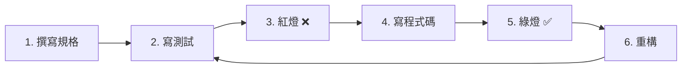

# 📘 SDD 開發技術 - 完整教材與實戰專案說明

## 🎯 專案概覽

本教材提供從**規格驅動開發 (SDD)** 理論到實戰的完整學習路徑，包含：

### 1. 📖 理論教材：`開發大綱.md`

完整的 SDD 學習大綱，包含：
- ✅ **模組 0**：規格驅動思維（已完整擴充）
- ✅ **模組 1**：開發者工具包（已完整擴充）
- ⏳ **模組 2**：SDD 核心循環實戰（待擴充）
- ⏳ **模組 3**：軟體架構入門（待擴充）
- ⏳ **模組 4**：進階 AI 協作（待擴充）

### 2. 💻 實戰專案：`sdd-practice-project/`

完整的練習專案，包含：
- ✅ 登入功能（完整實作範例）
- ✅ 購物車功能（供學習者練習）
- ✅ 完整的測試套件
- ✅ 專案配置檔案
- ✅ 快速開始指南

---

## 📁 檔案結構

```
SDD開發技術/
├── 開發大綱.md                     # 📖 主要教材（已擴充模組0和1）
├── README_實戰專案說明.md           # 📘 本檔案
│
└── sdd-practice-project/           # 💻 實戰練習專案
    ├── README.md                   # 專案說明
    ├── QUICK_START.md              # 🚀 快速開始指南
    ├── package.json                # npm 專案設定
    ├── .gitignore                  # Git 忽略檔案
    │
    ├── specs/                      # 📋 規格文件
    │   ├── login.spec.md           # 登入功能規格（範例）
    │   └── cart.spec.md            # 購物車功能規格（練習）
    │
    ├── tests/                      # 🧪 測試程式
    │   ├── login.test.js           # 登入測試（完整實作）
    │   └── cart.test.js            # 購物車測試（待完成）
    │
    └── src/                        # 💻 原始碼
        ├── login.js                # 登入實作（完整範例）
        └── cart.js                 # 購物車實作（待實作）
```

---

## 🚀 立即開始

### 方案 A：學習理論

```bash
# 閱讀主要教材
cd SDD開發技術
code 開發大綱.md

# 或在瀏覽器中閱讀
open 開發大綱.md
```

**推薦學習順序：**
1. 模組 0：規格驅動思維（30-60 分鐘）
2. 模組 1：開發者工具包（60-120 分鐘）
3. 動手實作（見方案 B）

### 方案 B：動手實戰

```bash
# 進入實戰專案
cd sdd-practice-project

# 安裝依賴
npm install

# 執行測試（查看範例）
npm test

# 開始練習
code QUICK_START.md
```

---

## 📖 模組 0 和 1 詳細內容

### ✅ 模組 0：規格驅動思維（已完整擴充）

**包含內容：**

#### 1. 理論基礎
- 什麼是規格驅動開發
- 為什麼需要規格（對照表）
- SDD 的核心原則

#### 2. User Story 完整教學
- 三段式結構（Who-What-Why）
- 2 個實戰範例
- 撰寫技巧與常見錯誤

#### 3. Acceptance Criteria 詳解
- Gherkin 語法（Given-When-Then）
- 6 個完整場景範例
- 場景檢查清單

#### 4. AI 審查流程
- 3 步驟審查方法
- 實戰 Prompt 範本
- 迭代式精煉流程

#### 5. 模組總結
- 關鍵字彙表（含 AI 學習關鍵字）
- 延伸學習資源
- 3 個實戰練習

**學習時間：** 約 30-60 分鐘  
**實戰練習：** 約 60-120 分鐘

---

### ✅ 模組 1：開發者工具包（已完整擴充）

**包含內容：**

#### 1. VS Code 安裝與設定
- 完整安裝步驟
- 必裝擴充功能列表
- 基本設定檔範例
- 常用快捷鍵速查表

#### 2. Git 完整教學
- 安裝與初始設定
- 基本流程實戰
- 分支管理
- GitHub 連結
- 常用命令速查表
- 最佳實踐（Commit Message 規範）

#### 3. Node.js & npm
- 安裝指南
- npm 專案初始化
- package.json 設定
- 常用命令
- 套件管理

#### 4. Jest 測試框架
- 安裝與設定
- 建立第一個測試
- 執行測試命令

#### 5. 模組總結
- 關鍵字彙表
- 延伸學習資源
- 3 個實戰練習

**學習時間：** 約 60-120 分鐘  
**環境設定：** 約 30-60 分鐘

---

## 💻 實戰專案使用指南

### 專案 1：登入功能（完整範例）

**目的：** 理解 SDD 完整流程

**檔案：**
- `specs/login.spec.md` - 詳細規格
- `tests/login.test.js` - 完整測試（28 個測試案例）
- `src/login.js` - 完整實作

**學習方式：**
1. 閱讀規格 → 2. 查看測試 → 3. 研究實作 → 4. 執行測試

**涵蓋主題：**
- ✅ 6 個完整場景（成功、失敗、驗證、鎖定等）
- ✅ 輸入驗證
- ✅ 錯誤處理
- ✅ 安全機制
- ✅ Token 管理
- ✅ 記住我功能

---

### 專案 2：購物車功能（練習專案）

**目的：** 親手完成 SDD 循環

**檔案：**
- `specs/cart.spec.md` - 完整規格（9 個場景）
- `tests/cart.test.js` - 測試框架（待完成）
- `src/cart.js` - 實作框架（待實作）

**任務：**
1. 完成所有測試案例
2. 實作購物車功能
3. 達到 90% 測試覆蓋率

**涵蓋主題：**
- 🔄 加入商品
- ➕ 數量調整
- 🗑️ 移除商品
- 💰 價格計算
- ✅ 輸入驗證
- 📊 邊界測試

---

## 🎓 建議學習流程

### 週次規劃（每週 5-10 小時）

#### 第 1 週：理論基礎
- [ ] 閱讀模組 0（規格驅動思維）
- [ ] 完成模組 0 的練習
- [ ] 閱讀模組 1（開發者工具包）
- [ ] 完成環境設定

#### 第 2 週：理解範例
- [ ] 研究登入功能規格
- [ ] 分析登入功能測試
- [ ] 理解登入功能實作
- [ ] 嘗試修改並觀察測試反應

#### 第 3 週：實作練習（基礎）
- [ ] 閱讀購物車規格
- [ ] 完成場景 1-3 的測試
- [ ] 實作對應功能
- [ ] 達到 60% 覆蓋率

#### 第 4 週：實作練習（進階）
- [ ] 完成所有測試案例
- [ ] 完成所有功能實作
- [ ] 達到 90% 覆蓋率
- [ ] 重構優化程式碼

---

## 🛠️ 開發工作流

### 標準 SDD 循環



### 實際操作步驟

```bash
# 1. 閱讀並理解規格
code specs/cart.spec.md

# 2. 撰寫測試
code tests/cart.test.js

# 3. 執行測試（應該失敗）
npm test tests/cart.test.js

# 4. 實作功能
code src/cart.js

# 5. 再次測試（應該通過）
npm test tests/cart.test.js

# 6. 查看覆蓋率
npm run test:coverage

# 7. 重構（保持測試通過）
code src/cart.js

# 8. 提交版本
git add .
git commit -m "feat: 完成購物車場景一"
```

---

## 🤖 AI 輔助開發

### 生成測試

```
你是一位專精於 TDD 的開發者。請根據以下規格，使用 Jest 撰寫測試：

[貼上 specs/cart.spec.md 中的場景]

要求：
1. 使用 describe 和 test 組織測試
2. 每個 Given-When-Then 對應測試步驟
3. 包含適當的 expect 斷言
4. 測試描述要清晰
```

### 生成實作

```
以下是失敗的 Jest 測試：

[貼上測試程式碼]

請實作能讓測試通過的程式碼。要求：
1. 使用 JavaScript
2. 程式碼要簡潔易讀
3. 包含適當的錯誤處理
4. 加上必要的註解
```

### Code Review

```
請檢查以下程式碼並給予改進建議：

[貼上程式碼]

從以下角度分析：
1. Clean Code 原則
2. 效能考量
3. 安全性問題
4. 可維護性
5. 測試覆蓋率
```

---

## 📊 學習成效檢核

### 初學者檢核表
- [ ] 理解 User Story 的三段式結構
- [ ] 能寫出基本的 Gherkin 場景
- [ ] 知道如何使用 Git 基本命令
- [ ] 能看懂 Jest 測試程式碼
- [ ] 完成環境設定

### 進階檢核表
- [ ] 能獨立撰寫完整的規格
- [ ] 能將規格轉換為測試
- [ ] 能實作通過測試的程式碼
- [ ] 理解 TDD 的紅綠循環
- [ ] 測試覆蓋率 > 60%

### 專家檢核表
- [ ] 能設計模組化的規格
- [ ] 測試覆蓋率 > 90%
- [ ] 程式碼符合 Clean Code 原則
- [ ] 能使用 AI 高效協作
- [ ] 能審查他人的規格和程式碼

---

## 🎯 下一步

### 完成現有內容後

#### 1. 進階挑戰
- 為購物車加入優惠券功能
- 實作運費計算
- 加入商品推薦

#### 2. 新功能練習
- 自己設計一個新功能的規格
- 實作完整的 SDD 循環
- 達到 95% 測試覆蓋率

#### 3. 實際專案應用
- 在工作專案中導入 SDD
- 建立團隊的規格範本
- 分享你的學習成果

---

## 📚 相關資源

### 內部文件
- `開發大綱.md` - 主要教材
- `sdd-practice-project/README.md` - 專案說明
- `sdd-practice-project/QUICK_START.md` - 快速開始
- `specs/*.spec.md` - 規格範例

### 外部資源
- [Jest 官方文件](https://jestjs.io/)
- [Git Book](https://git-scm.com/book/zh-tw/v2)
- [Clean Code JavaScript](https://github.com/ryanmcdermott/clean-code-javascript)
- [TDD by Example](https://www.amazon.com/Test-Driven-Development-Kent-Beck/dp/0321146530)

---

## ❓ 常見問題

### Q: 我應該從哪裡開始？

A: 推薦順序：
1. 閱讀 `開發大綱.md` 模組 0
2. 完成環境設定（模組 1）
3. 研究登入功能範例
4. 實作購物車功能

### Q: 需要多少時間完成？

A: 
- **快速瀏覽**：2-3 小時
- **理解範例**：5-8 小時
- **完整實作**：15-20 小時
- **精通應用**：40+ 小時

### Q: 可以跳過理論直接實作嗎？

A: 不建議。理論部分（模組 0）提供了重要的思維框架，有助於理解為什麼要這樣做。建議至少閱讀模組 0 的核心概念。

### Q: 測試一直失敗怎麼辦？

A: 
1. 仔細閱讀錯誤訊息
2. 參考登入功能的實作
3. 使用 `console.log()` 除錯
4. 詢問 AI 或查看文件

---

## 🎉 完成認證

完成以下所有項目後，你就掌握了 SDD 的核心技能：

### 🏆 SDD 認證檢核
- [ ] 完成模組 0 和模組 1 的學習
- [ ] 理解登入功能的完整實作
- [ ] 完成購物車功能所有測試
- [ ] 完成購物車功能所有實作
- [ ] 測試覆蓋率達到 90% 以上
- [ ] 程式碼通過 ESLint 檢查
- [ ] 能獨立設計新功能的規格
- [ ] 能有效使用 AI 輔助開發

---

## 📞 回饋與貢獻

如果你發現任何問題或有改進建議，歡迎：
1. 提出 Issue
2. 送出 Pull Request
3. 分享你的學習心得

---

## 📄 授權

本教材採用 MIT License，可自由使用於學習和教學用途。

---

**祝你學習愉快！成為 SDD 專家！** 🚀
