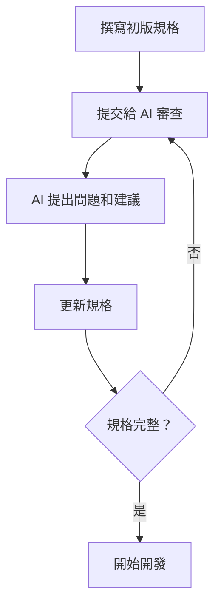
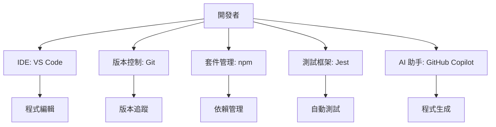

# 自學計畫：從 Vibe Coding 到 AI 賦能的軟體開發

## 📘 課程簡介

本課程將引導您從傳統的程式開發思維，轉變為運用 AI 工具進行**規格驅動開發 (Specification-Driven Development, SDD)** 的現代開發者。您將學會如何將想法結構化、如何指導 AI 協助開發、以及如何建立可維護的軟體系統。

### 💡 學習前提
- 基礎程式概念（變數、函式、條件判斷）
- 願意學習新工具和思維模式
- 擁有一台能上網的電腦

### 🎓 學習成果
完成本課程後，您將能夠：
1. 撰寫清晰、可執行的軟體規格
2. 使用 AI 工具加速開發流程
3. 建立測試驅動的開發工作流
4. 設計模組化的軟體架構
5. 成為 AI 協作開發的專家

---

# 模組 0：規格驅動思維 — 將想法轉為指令的藝術

## 🎯 核心目標
克服「不知如何開規格」的障礙，學會將腦中模糊的想法，翻譯成 AI 和工程師都能精準理解的結構化語言。

## 📖 理論基礎

### 什麼是規格驅動開發？
規格驅動開發 (SDD) 是一種將**需求規格**置於開發流程核心的方法論。與傳統「先寫程式，再想需求」的方式不同，SDD 強調：

1. **規格先行**：在寫任何程式碼前，先清楚定義「要做什麼」
2. **規格即文件**：規格本身就是最準確的文件
3. **規格可測試**：規格應該能轉換為自動化測試
4. **規格是溝通工具**：團隊、AI、未來的自己都能理解

### 為什麼需要規格？

| 沒有規格 | 有規格 |
|---------|--------|
| ❌ 開發方向不明確 | ✅ 明確知道要做什麼 |
| ❌ 容易遺漏邊界情況 | ✅ 涵蓋各種場景 |
| ❌ 難以與他人協作 | ✅ 標準化的溝通語言 |
| ❌ AI 產出品質不佳 | ✅ AI 能精準生成程式碼 |
| ❌ 修改需求時容易出錯 | ✅ 修改規格即更新文件 |

## 🛠️ 學習路徑與實戰範例
### 📝 第一步：用「故事」捕捉價值 (User Story)

#### 理論說明
User Story（使用者故事）是敏捷開發中最重要的需求描述工具。它使用簡單的三段式結構：

```
身為 <角色 Who>，我想要 <功能 What>，以便於 <價值 Why>
```

**三個要素解析：**
- **角色 (Who)**：誰需要這個功能？（網站會員、管理員、訪客等）
- **功能 (What)**：具體要做什麼？（登入、搜尋、購買等）
- **價值 (Why)**：為什麼需要？帶來什麼好處？

#### 實戰範例 1：登入功能

```markdown
# specs/login.spec.md

## 功能概述
本規格定義網站會員的登入功能，包含帳號密碼驗證與登入後的導向行為。

## 使用者故事 (User Story)

### US-001: 基本登入功能
身為一個 **網站會員**，  
我想要 **透過帳號密碼登入**，  
以便於 **看到我個人的儀表板並管理我的資料**。

**商業價值：** 保護會員隱私，提供個人化服務
**優先級：** 🔴 高（核心功能）
```

#### 實戰範例 2：電商購物車

```markdown
# specs/cart.spec.md

## 使用者故事 (User Story)

### US-002: 加入購物車
身為一個 **潛在買家**，  
我想要 **將商品加入購物車**，  
以便於 **稍後一次結帳購買多個商品**。

### US-003: 修改數量
身為一個 **準備結帳的買家**，  
我想要 **在購物車中調整商品數量**，  
以便於 **在結帳前修正我要購買的數量**。
```

#### 💡 撰寫技巧

1. **角色要具體**：不要寫「使用者」，而是「首次訪問的訪客」、「付費會員」
2. **功能要可測試**：避免「提升使用者體驗」這種模糊描述
3. **價值要明確**：說明為什麼這個功能重要
4. **一個故事一個重點**：不要在一個故事裡塞太多功能

#### ⚠️ 常見錯誤

❌ **太技術導向**
```
身為一個開發者，我想要使用 JWT token，以便於實作身份驗證
```
✅ **正確的業務導向**
```
身為一個網站會員，我想要登入後能在不同頁面保持登入狀態，以便於無需重複登入
```

❌ **太模糊**
```
身為使用者，我想要好用的介面，以便於方便使用
```
✅ **具體明確**
```
身為初次使用的訪客，我想要在首頁看到清楚的註冊按鈕，以便於快速完成帳號申請
```
### 🎬 第二步：用「場景」定義成敗 (Acceptance Criteria)

#### 理論說明
驗收條件 (Acceptance Criteria, AC) 是判斷功能「完成」的標準。我們使用 **Gherkin 語法**，這是一種接近自然語言的結構化描述方式。

**Gherkin 三段式：**
- **Given（假設）**：初始狀態、前置條件
- **When（當）**：執行的動作、觸發的事件  
- **Then（那麼）**：預期的結果、系統的反應

#### 完整實戰範例：登入功能

```markdown
# specs/login.spec.md (續)

## 驗收條件 (Acceptance Criteria)

### ✅ 場景一：成功登入
```gherkin
Given 我是一個已註冊會員
  And 我的帳號是 "user@example.com"
  And 我的密碼是 "SecurePass123!"
  And 我在登入頁面 "/login"
When 我在帳號欄位輸入 "user@example.com"
  And 我在密碼欄位輸入 "SecurePass123!"
  And 我點擊「登入」按鈕
Then 我應該被重新導向到 "/dashboard"
  And 我應該看到歡迎訊息 "歡迎回來，張三！"
  And 系統應該設定 authentication token
  And token 有效期限應該是 24 小時
```

### ❌ 場景二：密碼錯誤
```gherkin
Given 我是一個已註冊會員，帳號是 "user@example.com"
  And 我在登入頁面
When 我輸入帳號 "user@example.com"
  And 我輸入錯誤密碼 "wrongpassword"
  And 我點擊「登入」按鈕
Then 頁面應該停留在 "/login"
  And 我應該看到錯誤訊息 "帳號或密碼不正確"
  And 密碼欄位應該被清空
  And 帳號欄位應該保留原本的輸入
  And 登入按鈕應該維持可點擊狀態
```

### ⚠️ 場景三：帳號不存在
```gherkin
Given 我在登入頁面
When 我輸入一個不存在的帳號 "notexist@example.com"
  And 我輸入任意密碼
  And 我點擊「登入」按鈕
Then 我應該看到相同的錯誤訊息 "帳號或密碼不正確"
  And 系統不應該透露該帳號是否存在（安全考量）
```

### 🔒 場景四：帳號已被鎖定
```gherkin
Given 我的帳號 "locked@example.com" 因為連續 5 次登入失敗而被鎖定
When 我輸入正確的帳號和密碼
  And 我點擊「登入」按鈕
Then 我應該看到訊息 "您的帳號已被暫時鎖定，請 30 分鐘後再試或聯繫客服"
  And 我不應該被允許登入
```

### ⏱️ 場景五：Session 逾時
```gherkin
Given 我已經成功登入
  And 我已經閒置超過 30 分鐘
When 我嘗試執行任何需要驗證的操作
Then 系統應該重新導向我到登入頁面
  And 我應該看到訊息 "您的登入已過期，請重新登入"
```

### 📱 場景六：記住我功能
```gherkin
Given 我在登入頁面
When 我輸入正確的帳號密碼
  And 我勾選「記住我」選項
  And 我點擊登入
Then 系統應該設定 refresh token（有效期 30 天）
  And 下次瀏覽器開啟時應該自動登入
```

```

#### 💡 撰寫完整場景的要點

1. **涵蓋所有路徑**
   - ✅ 成功路徑 (Happy Path)
   - ❌ 失敗路徑 (Error Path)
   - ⚠️ 邊界情況 (Edge Cases)
   - 🔒 安全考量 (Security)

2. **具體而明確**
   - 指定確切的 URL 路徑
   - 指明錯誤訊息的確切文字
   - 說明 UI 元素的狀態變化

3. **可測試性**
   - 每個條件都應該能轉換為測試程式碼
   - 避免主觀描述（如「使用者感到滿意」）

4. **獨立性**
   - 每個場景應該能獨立執行
   - 不依賴其他場景的執行順序

#### 🎯 場景檢查清單

撰寫完場景後，檢查是否涵蓋：
- [ ] 正常操作流程
- [ ] 輸入驗證（格式錯誤、空白、特殊字元）
- [ ] 權限檢查（未登入、權限不足）
- [ ] 錯誤處理（網路錯誤、伺服器錯誤）
- [ ] 邊界值（最大最小值、空陣列）
- [ ] 安全性（SQL Injection、XSS）
- [ ] 效能考量（大量資料、併發請求）
### 🤖 第三步：用「對話」精煉規格 (AI as a Spec Review Coach)

#### 為什麼需要 AI Review？
即使是經驗豐富的開發者，也容易遺漏某些場景。AI 可以擔任：
- 🔍 **規格審查員**：找出模糊或不完整的地方
- 💡 **場景建議者**：提出你可能沒想到的邊界情況
- 📝 **文件優化師**：改善規格的可讀性

#### 實戰演練：AI 規格審查流程

##### Step 1: 準備審查 Prompt

```markdown
你是一位資深的系統分析師和 QA 專家，擁有 10 年以上的軟體需求分析經驗。

請審查以下規格文件，並提供專業建議：

1. **完整性檢查**：是否遺漏重要場景？
2. **明確性檢查**：是否有模糊不清的描述？
3. **測試性檢查**：是否所有條件都可以被測試？
4. **安全性檢查**：是否考慮了安全風險？
5. **使用者體驗檢查**：是否有不合理的流程？

---
[貼上你的 login.spec.md 內容]
---

請以清單方式列出你的發現，並為每個問題提供具體的改善建議。
```

##### Step 2: AI 可能提出的問題範例

**AI 的回覆可能包含：**

> 📋 **審查報告：登入功能規格**
> 
> **🔴 嚴重問題（必須處理）：**
> 1. **帳號格式驗證**：規格未定義有效的帳號格式（Email? 手機? 使用者名稱?）
> 2. **密碼強度要求**：未說明密碼需符合什麼規則
> 3. **CAPTCHA 驗證**：多次失敗後是否需要驗證碼？
> 
> **🟡 建議新增的場景：**
> 4. **網路斷線情況**：登入請求送出後網路斷線如何處理？
> 5. **同時多裝置登入**：同帳號在不同裝置登入的行為？
> 6. **密碼重設流程**：使用者忘記密碼時該怎麼做？
> 7. **首次登入流程**：新帳號首次登入是否有特殊流程？
> 
> **🔵 文件優化建議：**
> 8. **錯誤訊息**：建議統一錯誤訊息格式並建立錯誤代碼表
> 9. **效能需求**：建議定義登入 API 的回應時間要求

##### Step 3: 根據 AI 建議更新規格

```markdown
# specs/login.spec.md (更新版)

## 帳號格式規則
- **帳號類型**：Email 地址
- **格式驗證**：必須符合標準 Email 格式 (RFC 5322)
- **範例**：`user@example.com`

## 密碼規則
- **最小長度**：8 個字元
- **必須包含**：至少一個大寫字母、一個小寫字母、一個數字
- **建議包含**：特殊符號 (!@#$%^&*)

## 安全機制

### 場景七：登入嘗試限制
```gherkin
Given 我使用相同帳號連續登入失敗 3 次
When 我嘗試第 4 次登入
Then 系統應該顯示 CAPTCHA 驗證
  And 我必須完成 CAPTCHA 才能繼續嘗試

Given 我使用相同帳號連續登入失敗 5 次
When 我嘗試第 6 次登入
Then 系統應該鎖定該帳號 30 分鐘
  And 顯示訊息「帳號已暫時鎖定，請稍後再試」
```

### 場景八：網路異常處理
```gherkin
Given 我填寫了正確的登入資訊
When 我點擊登入按鈕
  And 網路請求超時（超過 10 秒）
Then 系統應該顯示「網路連線逾時，請檢查網路後重試」
  And 登入按鈕應該恢復可點擊狀態
```
```

#### 🔄 迭代式規格精煉流程



#### 💬 更多實用的 AI 審查 Prompts

**1. 技術可行性檢查**
```
請從技術實作的角度，檢查這份規格是否有技術上難以實現或成本過高的需求。
```

**2. 使用者體驗評估**
```
請從 UX 設計師的角度，評估這個登入流程是否符合使用者體驗最佳實踐。
```

**3. 安全稽核**
```
請從資安專家的角度，找出這份規格中可能存在的安全漏洞，參考 OWASP Top 10。
```

**4. 無障礙檢查**
```
請檢查這份規格是否考慮了無障礙設計 (WCAG 2.1)，例如鍵盤操作、螢幕閱讀器支援。
```
## 🔍 模組 0 總結

### 關鍵字彙表 (Keywords)

| 英文術語 | 中文翻譯 | 說明 | AI 學習關鍵字 |
|---------|---------|------|-------------|
| **User Story** | 使用者故事 | 描述功能需求的標準格式 | "user story examples", "writing effective user stories" |
| **Acceptance Criteria** | 驗收條件 | 判斷功能是否完成的標準 | "acceptance criteria best practices", "AC vs DoD" |
| **Gherkin** | Gherkin 語法 | Given/When/Then 的結構化語法 | "Gherkin syntax tutorial", "BDD Gherkin examples" |
| **Edge Cases** | 邊界情況 | 極端或特殊的使用場景 | "edge cases in testing", "boundary value analysis" |
| **Happy Path** | 成功路徑 | 一切正常的理想流程 | "happy path vs edge cases" |
| **Specification** | 規格 | 功能的詳細定義文件 | "software specification document", "spec-driven development" |

### 重點回顧

✅ **核心概念**
- 規格是開發的「北極星」，指引所有開發活動
- 專注於「What (做什麼)」，而不是「How (怎麼做)」
- 規格是溝通工具，不是技術文件
- 好的規格 = 可測試 + 可理解 + 完整

✅ **實踐方法**
1. 用 User Story 捕捉價值
2. 用 Acceptance Criteria 定義成敗
3. 用 AI 對話精煉規格
4. 迭代直到規格清晰完整

### 📚 延伸學習資源

#### 書籍推薦
- 📖 《User Story Mapping》by Jeff Patton
- 📖 《Specification by Example》by Gojko Adzic
- 📖 《BDD in Action》by John Ferguson Smart

#### 線上資源
- 🔗 [Atlassian: Writing User Stories](https://www.atlassian.com/agile/project-management/user-stories)
- 🔗 [Cucumber Gherkin Reference](https://cucumber.io/docs/gherkin/reference/)
- 🔗 [INVEST in Good Stories](https://www.agilealliance.org/glossary/invest/)

#### AI 輔助學習 Prompts
```
💡 "給我 10 個電商網站的 User Story 範例，涵蓋前台和後台功能"
💡 "解釋 User Story 和 Use Case 的差異，並提供比較表格"
💡 "如何寫出可測試的 Acceptance Criteria？給我一個完整的教學"
💡 "分析這個 User Story 有什麼問題：身為使用者，我想要好用的系統"
💡 "什麼是 BDD (Behavior-Driven Development)？它和 TDD 有什麼不同?"
```

### ✍️ 實戰練習

**練習 1：撰寫 User Story**
為以下功能撰寫 User Story：
- [ ] 電商網站的「加入我的最愛」功能
- [ ] 部落格的「文章搜尋」功能
- [ ] 銀行 APP 的「轉帳」功能

**練習 2：撰寫 Acceptance Criteria**
為「忘記密碼」功能撰寫完整的 Gherkin 場景，至少包含：
- 成功重設密碼
- Email 不存在
- 驗證碼錯誤
- 驗證碼過期

**練習 3：AI Review**
將你撰寫的規格提交給 AI 審查，並根據反饋改進。

---

# 模組 1：開發者工具包 — 打造你的 AI 開發工場

## 🎯 核心目標
克服對專業開發工具的恐懼，建立一個能執行 SDD 流程的標準化環境。掌握版本控制、IDE、測試框架等現代開發必備工具。

## 📖 理論基礎

### 為什麼需要專業開發工具？

| 手動開發 | 工具化開發 |
|---------|----------|
| ⏰ 重複性工作耗時 | ⚡ 自動化節省時間 |
| 🐛 容易出錯 | ✅ 減少人為失誤 |
| 👤 依賴個人記憶 | 📝 系統化管理 |
| 😰 難以協作 | 🤝 標準化流程 |
| 🔙 無法回溯 | ⏮️ 版本追蹤 |

### 開發工具生態系



## 🛠️ 學習路徑與實戰指南

### 💻 步驟 1：安裝 VS Code

**快速安裝：**
1. 前往 https://code.visualstudio.com/
2. 下載並安裝適合你作業系統的版本
3. 開啟 VS Code

**必裝擴充功能：**
```bash
# 在 VS Code 中按 Cmd/Ctrl + Shift + X 開啟擴充功能面板
# 搜尋並安裝以下擴充：
- GitHub Copilot        # AI 程式碼助手
- Prettier              # 程式碼格式化
- ESLint                # 程式碼檢查
- GitLens               # Git 增強功能
```

**基本設定（settings.json）：**
```json
{
  "editor.formatOnSave": true,
  "editor.defaultFormatter": "esbenp.prettier-vscode",
  "editor.tabSize": 2,
  "files.autoSave": "afterDelay"
}
```

**常用快捷鍵：**
- `Cmd/Ctrl + P` - 快速開檔
- `Cmd/Ctrl + Shift + P` - 命令面板
- `Ctrl + `` - 開啟終端機

---

### ⏰ 步驟 2：安裝 Git

**安裝 Git：**
```bash
# macOS
brew install git

# Windows: 下載 https://git-scm.com/download/win

# Linux (Ubuntu)
sudo apt-get install git
```

**初始設定：**
```bash
git config --global user.name "你的名字"
git config --global user.email "your.email@example.com"
git config --global init.defaultBranch main
```

**Git 基本流程實戰：**
```bash
# 1. 建立專案並初始化 Git
mkdir my-sdd-project
cd my-sdd-project
git init

# 2. 建立第一個規格檔
mkdir specs
echo "# 登入功能規格" > specs/login.spec.md

# 3. 提交到 Git
git add .
git commit -m "feat: 初始化專案並新增登入規格"

# 4. 查看歷史
git log --oneline
```

**Git 分支管理：**
```bash
# 建立功能分支
git checkout -b feature/shopping-cart

# 開發並提交
git add .
git commit -m "feat: 新增購物車規格"

# 切回主分支並合併
git checkout main
git merge feature/shopping-cart
```

**連結 GitHub：**
```bash
# 1. 在 GitHub 建立新 Repository

# 2. 連結遠端儲存庫
git remote add origin https://github.com/你的帳號/my-sdd-project.git

# 3. 推送到 GitHub
git push -u origin main
```

**常用 Git 命令：**
| 命令 | 說明 |
|------|------|
| `git status` | 查看當前狀態 |
| `git add .` | 加入所有變更 |
| `git commit -m "msg"` | 提交版本 |
| `git log --oneline` | 查看歷史 |
| `git branch` | 查看分支 |
| `git checkout <branch>` | 切換分支 |
| `git pull` | 拉取更新 |
| `git push` | 推送到遠端 |

---

### 🚀 步驟 3：安裝 Node.js & npm

**安裝 Node.js：**
```bash
# 下載 LTS 版本
# https://nodejs.org/

# 或使用套件管理器
brew install node  # macOS

# 驗證安裝
node --version
npm --version
```

**初始化 npm 專案：**
```bash
cd my-sdd-project
npm init -y
```

**package.json 範例：**
```json
{
  "name": "my-sdd-project",
  "version": "1.0.0",
  "scripts": {
    "test": "jest",
    "test:watch": "jest --watch"
  }
}
```

**安裝套件：**
```bash
# 安裝開發套件
npm install --save-dev jest

# 安裝其他常用套件
npm install --save-dev prettier eslint
```

**npm 常用命令：**
| 命令 | 說明 |
|------|------|
| `npm init -y` | 初始化專案 |
| `npm install <package>` | 安裝套件 |
| `npm install -D <package>` | 安裝開發套件 |
| `npm test` | 執行測試 |
| `npm run <script>` | 執行自訂腳本 |

---

### 🧪 步驟 4：設定 Jest 測試框架

**安裝 Jest：**
```bash
npm install --save-dev jest
```

**設定 package.json：**
```json
{
  "scripts": {
    "test": "jest",
    "test:watch": "jest --watch",
    "test:coverage": "jest --coverage"
  }
}
```

**建立第一個測試：**
```javascript
// tests/login.test.js
describe('登入功能測試', () => {
  test('應該能成功登入', () => {
    expect(true).toBe(true);
  });
});
```

**執行測試：**
```bash
npm test
```

---

## 🔍 模組 1 總結

### 關鍵字彙表

| 英文術語 | 中文翻譯 | 說明 | AI 學習關鍵字 |
|---------|---------|------|-------------|
| **IDE** | 整合開發環境 | 程式碼編輯器 | "VS Code tutorial", "IDE setup" |
| **Git** | 版本控制系統 | 管理程式碼歷史 | "Git basics", "version control tutorial" |
| **Repository** | 儲存庫 | 專案的 Git 倉庫 | "Git repository", "GitHub repo" |
| **Commit** | 提交 | 儲存變更的版本 | "Git commit best practices" |
| **Branch** | 分支 | 獨立的開發線 | "Git branching strategy" |
| **npm** | 套件管理器 | Node.js 的套件管理工具 | "npm tutorial", "package.json" |
| **Jest** | 測試框架 | JavaScript 測試工具 | "Jest testing tutorial" |

### 重點回顧

✅ **工具鏈建立**
- VS Code：現代化的程式碼編輯器
- Git：版本控制，追蹤每一次變更
- Node.js & npm：執行環境與套件管理
- Jest：自動化測試框架

✅ **工作流程**
1. 用 Git 管理規格和程式碼
2. 用 npm 管理專案依賴
3. 用 Jest 驗證程式正確性
4. 用 GitHub 協作與備份

### 📚 延伸學習資源

**線上資源：**
- 🔗 [VS Code 官方文件](https://code.visualstudio.com/docs)
- 🔗 [Git Pro Book](https://git-scm.com/book/zh-tw/v2)
- 🔗 [npm 文件](https://docs.npmjs.com/)
- 🔗 [Jest 官方教學](https://jestjs.io/docs/getting-started)

**AI 輔助學習 Prompts：**
```
💡 "給我一個完整的 VS Code 快捷鍵速查表"
💡 "解釋 Git 的 staging area 概念並提供圖解"
💡 "npm install 和 npm ci 有什麼差別？"
💡 "如何用 Jest 測試異步函數？給我範例"
💡 "Git merge 和 rebase 的差異和使用時機"
```

### ✍️ 實戰練習

**練習 1：完整環境設置**
- [ ] 安裝 VS Code 並設定擴充功能
- [ ] 安裝 Git 並完成初始設定
- [ ] 建立一個新專案並初始化 Git
- [ ] 至少做 3 次有意義的 commit

**練習 2：Git 操作熟練**
- [ ] 建立一個功能分支
- [ ] 在分支上新增規格檔案
- [ ] 合併分支到 main
- [ ] 推送到 GitHub

**練習 3：npm 與 Jest**
- [ ] 初始化 npm 專案
- [ ] 安裝 Jest
- [ ] 建立並執行第一個測試
- [ ] 查看測試覆蓋率報告

---
# 模組 2：SDD 核心循環實戰 — 從規格到綠燈的魔法

## 🎯 核心目標
親手走完「規格 → 測試 → 程式碼」的核心循環，體驗 TDD (測試驅動開發) 的威力，並學會如何「導演」AI 完成開發。

## 📖 理論基礎

### 什麼是 TDD？
**測試驅動開發 (Test-Driven Development, TDD)** 是一種開發方法論，核心理念是：**先寫測試，再寫程式碼**。

### TDD 三部曲：Red-Green-Refactor

```
🔴 RED（紅燈）      → 🟢 GREEN（綠燈）    → 🔵 REFACTOR（重構）
寫一個會失敗的測試   實作讓測試通過的程式碼   改善程式碼品質
      ↓                    ↓                     ↓
   這證明測試有效        功能已經實現           保持測試通過
```

### SDD + TDD 的完美結合

| SDD (規格驅動) | TDD (測試驅動) |
|---------------|---------------|
| 定義「要做什麼」 | 定義「如何驗證」 |
| 產出規格文件 | 產出測試程式碼 |
| 人類可讀 | 機器可執行 |
| 溝通工具 | 驗證工具 |

**結合後的威力：** 規格 → 測試 → 程式碼 → 自動驗證 ✅

---

## 🛠️ 實戰演練：完整的 SDD 循環

### 📝 階段 0：準備專案環境

```bash
# 確認已完成模組 1 的環境設定
cd sdd-practice-project
npm install

# 確認測試環境正常
npm test tests/login.test.js
```

---

### 📋 階段 1：撰寫規格

**目標：** 將想法轉換為結構化的規格

#### 實戰案例：「忘記密碼」功能

**Step 1.1：撰寫 User Story**

```markdown
# specs/forgot-password.spec.md

## 使用者故事

### US-003: 忘記密碼功能

**身為**一個忘記密碼的會員，  
**我想要**透過 Email 重設密碼，  
**以便於**重新取得帳號的存取權限。

**商業價值：** 降低客服成本，提升使用者體驗  
**優先級：** 🟡 中  
**預估工時：** 6 小時
```

**Step 1.2：定義驗收條件**

```markdown
## 驗收條件

### ✅ 場景一：成功發送重設密碼郵件

```gherkin
Given 我是一個已註冊會員，Email 是 "user@example.com"
  And 我在「忘記密碼」頁面
When 我輸入 "user@example.com"
  And 我點擊「發送重設連結」按鈕
Then 系統應該發送重設密碼郵件到該信箱
  And 我應該看到訊息 "重設連結已發送到您的信箱"
  And 郵件中應該包含有效期限為 1 小時的重設連結
```

### ❌ 場景二：Email 不存在

```gherkin
Given 我在「忘記密碼」頁面
When 我輸入一個不存在的 Email "notexist@example.com"
  And 我點擊「發送重設連結」按鈕
Then 系統應該顯示相同的成功訊息（不透露 Email 是否存在）
  And 實際上不發送任何郵件
```
```

**💡 關鍵重點：**
- 規格要具體（指明確切的訊息文字）
- 考慮安全性（不透露帳號是否存在）
- 定義時效性（連結有效期限）

---

### 🧪 階段 2：將規格轉換為測試

**目標：** 讓規格變成可執行的測試程式碼

#### 手動撰寫測試

```javascript
// tests/forgot-password.test.js
const { sendResetPasswordEmail, validateEmail } = require('../src/forgot-password');

describe('忘記密碼功能測試', () => {
  
  describe('✅ 場景一：成功發送重設密碼郵件', () => {
    test('應該成功發送重設郵件給已註冊的 Email', () => {
      // Arrange：準備測試資料
      const email = 'user@example.com';
      
      // Act：執行功能
      const result = sendResetPasswordEmail(email);
      
      // Assert：驗證結果
      expect(result.success).toBe(true);
      expect(result.message).toBe('重設連結已發送到您的信箱');
      expect(result.emailSent).toBe(true);
    });

    test('重設連結應該包含有效期限', () => {
      const result = sendResetPasswordEmail('user@example.com');
      
      expect(result.resetLink).toBeDefined();
      expect(result.expiresIn).toBe(3600); // 1 小時 = 3600 秒
    });
  });

  describe('❌ 場景二：Email 不存在', () => {
    test('不存在的 Email 應該顯示相同的成功訊息', () => {
      const result = sendResetPasswordEmail('notexist@example.com');
      
      // 為了安全，顯示相同的訊息
      expect(result.success).toBe(true);
      expect(result.message).toBe('重設連結已發送到您的信箱');
      
      // 但實際上沒有發送郵件
      expect(result.emailSent).toBe(false);
    });
  });
});
```

#### 使用 AI 生成測試

**Prompt 範本：**

```
你是一位專精於 TDD 的資深開發者。請根據以下規格，使用 Jest 撰寫測試程式碼。

## 規格內容
[貼上 specs/forgot-password.spec.md 的內容]

## 要求
1. 使用 Jest 測試框架
2. 每個 Gherkin 場景對應一個 describe 區塊
3. Given-When-Then 對應到 Arrange-Act-Assert
4. 使用清晰的測試描述
5. 包含所有必要的 expect 斷言
6. 考慮邊界情況和錯誤處理

請生成完整的測試檔案。
```

**💡 AI 生成後的檢查清單：**
- [ ] 測試描述是否清楚？
- [ ] 是否涵蓋所有場景？
- [ ] 斷言是否完整？
- [ ] 是否有遺漏的邊界情況？

---

### 🔴 階段 3：執行測試（紅燈階段）

**目標：** 確認測試正確執行且會失敗

```bash
# 執行測試
npm test tests/forgot-password.test.js
```

**預期結果：**
```
FAIL  tests/forgot-password.test.js
  忘記密碼功能測試
    ✅ 場景一：成功發送重設密碼郵件
      ✕ 應該成功發送重設郵件給已註冊的 Email (5ms)
      ✕ 重設連結應該包含有效期限 (2ms)

  ● 忘記密碼功能測試 › 應該成功發送重設郵件給已註冊的 Email

    Cannot find module '../src/forgot-password'
```

**💡 重點理解：**
- ❌ 測試失敗是**正常且必要**的
- 🎯 失敗表示測試在正確工作
- 📍 錯誤訊息指引你下一步要做什麼

**常見紅燈原因：**
1. 模組不存在 → 需要創建檔案
2. 函數不存在 → 需要定義函數
3. 返回值錯誤 → 需要實作邏輯
4. 斷言失敗 → 需要修正實作

---

### 💻 階段 4：實作功能（綠燈階段）

**目標：** 寫出最簡單能通過測試的程式碼

#### 策略 1：手動實作

```javascript
// src/forgot-password.js

// 模擬的使用者資料庫
const MOCK_USERS = {
  'user@example.com': {
    id: 'user_001',
    email: 'user@example.com',
    name: '張三'
  }
};

/**
 * 驗證 Email 格式
 */
function validateEmail(email) {
  const emailRegex = /^[^\s@]+@[^\s@]+\.[^\s@]+$/;
  return emailRegex.test(email);
}

/**
 * 生成重設密碼連結
 */
function generateResetLink(email) {
  const token = Buffer.from(`${email}:${Date.now()}`).toString('base64');
  return `https://example.com/reset-password?token=${token}`;
}

/**
 * 發送重設密碼郵件
 */
function sendResetPasswordEmail(email) {
  // 1. 驗證 Email 格式
  if (!validateEmail(email)) {
    return {
      success: false,
      message: '請輸入有效的 Email 格式'
    };
  }

  // 2. 標準化 Email
  const normalizedEmail = email.toLowerCase().trim();

  // 3. 檢查使用者是否存在
  const userExists = MOCK_USERS[normalizedEmail] !== undefined;

  // 4. 為了安全，總是顯示成功訊息
  const response = {
    success: true,
    message: '重設連結已發送到您的信箱'
  };

  // 5. 如果使用者存在，才真正發送郵件
  if (userExists) {
    const resetLink = generateResetLink(normalizedEmail);
    response.emailSent = true;
    response.resetLink = resetLink;
    response.expiresIn = 3600; // 1 小時

    // 實際專案中這裡會呼叫郵件服務
    console.log(`發送重設郵件到 ${normalizedEmail}`);
    console.log(`重設連結: ${resetLink}`);
  } else {
    // 使用者不存在，不發送郵件但顯示相同訊息
    response.emailSent = false;
  }

  return response;
}

module.exports = {
  sendResetPasswordEmail,
  validateEmail,
  generateResetLink
};
```

#### 策略 2：使用 AI 輔助實作

**Prompt 範本：**

```
以下是一個失敗的 Jest 測試：

```javascript
[貼上測試程式碼]
```

測試失敗訊息：
```
[貼上錯誤訊息]
```

請實作 src/forgot-password.js 檔案，包含所有必要的函數，讓測試通過。

要求：
1. 使用 JavaScript (Node.js)
2. 程式碼要簡潔易讀
3. 包含適當的註解
4. 考慮邊界情況
5. 適當的錯誤處理
6. 不洩漏安全資訊（例如：不透露帳號是否存在）
```

**💡 AI 輔助開發的最佳實踐：**
1. ✅ 先自己嘗試實作
2. ✅ 遇到困難時使用 AI
3. ✅ 仔細閱讀 AI 生成的程式碼
4. ✅ 理解每一行程式碼的作用
5. ✅ 根據需求調整和優化
6. ❌ 不要盲目複製貼上

---

### 🟢 階段 5：驗證通過（綠燈）

```bash
npm test tests/forgot-password.test.js
```

**預期結果：**
```
PASS  tests/forgot-password.test.js
  忘記密碼功能測試
    ✅ 場景一：成功發送重設密碼郵件
      ✓ 應該成功發送重設郵件給已註冊的 Email (8ms)
      ✓ 重設連結應該包含有效期限 (2ms)
    ❌ 場景二：Email 不存在
      ✓ 不存在的 Email 應該顯示相同的成功訊息 (3ms)

Test Suites: 1 passed, 1 total
Tests:       3 passed, 3 total
Time:        0.521s
```

**🎉 慶祝！** 所有測試通過，功能實作完成！

---

### 🔵 階段 6：重構優化

**目標：** 改善程式碼品質，保持測試通過

#### 重構檢查清單

**程式碼品質：**
- [ ] 函數是否單一職責？
- [ ] 變數命名是否清楚？
- [ ] 是否有重複的程式碼？
- [ ] 註解是否充足？
- [ ] 錯誤處理是否完善？

**效能優化：**
- [ ] 是否有不必要的計算？
- [ ] 資料結構是否合適？
- [ ] 是否有記憶體洩漏風險？

**安全性：**
- [ ] 是否洩漏敏感資訊？
- [ ] 輸入驗證是否充分？
- [ ] 是否防範常見攻擊？

#### 重構範例

**重構前：**
```javascript
function sendResetPasswordEmail(email) {
  if (!validateEmail(email)) {
    return { success: false, message: '請輸入有效的 Email 格式' };
  }
  const normalizedEmail = email.toLowerCase().trim();
  const userExists = MOCK_USERS[normalizedEmail] !== undefined;
  // ... 一大段程式碼
}
```

**重構後：**
```javascript
function sendResetPasswordEmail(email) {
  // 驗證輸入
  const validationError = validateInput(email);
  if (validationError) return validationError;

  // 標準化並檢查使用者
  const normalizedEmail = normalizeEmail(email);
  const user = findUser(normalizedEmail);

  // 生成回應
  return generateResponse(user, normalizedEmail);
}

// 拆分成多個小函數，每個函數職責單一
function validateInput(email) { /*...*/ }
function normalizeEmail(email) { /*...*/ }
function findUser(email) { /*...*/ }
function generateResponse(user, email) { /*...*/ }
```

**重構後再次測試：**
```bash
npm test tests/forgot-password.test.js
```

**💡 重構黃金法則：** 
> 重構時測試必須保持通過！如果測試失敗，立即回退。

---

## 🎯 實戰練習：完整流程演練

### 練習 1：個人資料更新功能

**任務：** 完成完整的 SDD 循環

1. **撰寫規格** (30 分鐘)
   - User Story
   - 至少 3 個場景的 Acceptance Criteria

2. **撰寫測試** (45 分鐘)
   - 每個場景對應的測試
   - 至少 10 個測試案例

3. **執行測試** (5 分鐘)
   - 確認紅燈（測試失敗）

4. **實作功能** (60 分鐘)
   - 讓所有測試通過

5. **重構** (30 分鐘)
   - 改善程式碼品質

**驗收標準：**
- [ ] 所有測試通過
- [ ] 測試覆蓋率 > 80%
- [ ] 程式碼有適當註解
- [ ] 通過 ESLint 檢查

---

## 🔍 模組 2 總結

### 關鍵字彙表

| 英文術語 | 中文翻譯 | 說明 | AI 學習關鍵字 |
|---------|---------|------|-------------|
| **TDD** | 測試驅動開發 | 先寫測試再寫程式碼 | "TDD tutorial", "test-driven development" |
| **Red-Green-Refactor** | 紅綠重構循環 | TDD 的三階段流程 | "TDD cycle", "red green refactor" |
| **Unit Test** | 單元測試 | 測試單一功能模組 | "unit testing best practices" |
| **Integration Test** | 整合測試 | 測試模組間的互動 | "integration testing guide" |
| **Test Coverage** | 測試覆蓋率 | 測試涵蓋的程式碼比例 | "code coverage tools" |
| **Assertion** | 斷言 | 驗證預期結果 | "Jest assertions", "expect methods" |
| **Mock** | 模擬物件 | 測試時替代真實物件 | "mocking in Jest", "test doubles" |

### 重點回顧

✅ **SDD + TDD 流程**
1. 撰寫規格（What）
2. 轉換為測試（How to verify）
3. 紅燈（Test fails）
4. 實作（Make it pass）
5. 綠燈（Test passes）
6. 重構（Make it better）

✅ **核心原則**
- 測試先行，程式碼隨後
- 失敗的測試是進度指標
- 小步前進，頻繁驗證
- 重構保持測試通過

✅ **AI 協作技巧**
- 用規格生成測試
- 用測試生成程式碼
- 用 AI 進行 Code Review
- 保持批判性思考

### 📚 延伸學習資源

**書籍推薦：**
- 📖 《Test-Driven Development by Example》by Kent Beck
- 📖 《The Art of Unit Testing》by Roy Osherove
- 📖 《Growing Object-Oriented Software, Guided by Tests》

**線上資源：**
- 🔗 [Jest 官方文件](https://jestjs.io/)
- 🔗 [TDD 實踐指南](https://martinfowler.com/bliki/TestDrivenDevelopment.html)
- 🔗 [Clean Code JavaScript](https://github.com/ryanmcdermott/clean-code-javascript)

**AI 輔助學習 Prompts：**
```
💡 "解釋 TDD 的 Red-Green-Refactor 循環，並提供實際範例"
💡 "如何撰寫好的單元測試？給我 10 個最佳實踐"
💡 "Jest 中 describe, test, expect 的用法和差異"
💡 "什麼時候該寫測試？什麼時候不需要？"
💡 "如何測試異步函數？給我 5 個範例"
💡 "Mock、Stub、Spy 的差異和使用時機"
```

### ✍️ 實戰練習

**練習 1：從規格到測試**
- [ ] 選擇一個功能撰寫規格
- [ ] 將規格轉換為至少 5 個測試案例
- [ ] 使用 AI 輔助生成測試
- [ ] 比較手寫和 AI 生成的差異

**練習 2：TDD 實作流程**
- [ ] 實作購物車的一個場景
- [ ] 嚴格遵循 Red-Green-Refactor
- [ ] 記錄每個階段的心得
- [ ] 測試覆蓋率達到 90%

**練習 3：重構演練**
- [ ] 找一段可以改進的程式碼
- [ ] 確保有測試覆蓋
- [ ] 進行重構
- [ ] 確認測試仍然通過

---
# 模組 3：軟體架構入門 — 從蓋茅屋到建高樓

## 🎯 核心目標
學習如何將一個大型複雜的專案，拆解成多個獨立、可管理的「規格模組」，並設計清晰的模組間介面。

## 📖 理論基礎

### 為什麼需要模組化？

**問題：** 隨著專案成長，程式碼變成「大泥球」
- 🔴 所有程式碼混在一起
- 🔴 修改一處影響全局
- 🔴 難以理解和維護
- 🔴 多人協作困難

**解決：** 模組化設計
- ✅ 關注點分離
- ✅ 獨立開發測試
- ✅ 易於維護擴展
- ✅ 團隊協作順暢

---

## 🛠️ 模組化設計實戰

### 步驟 1：識別功能模組

**電商網站範例：**

```
電商系統
├── 🔐 使用者管理 (Users)
│   ├── 註冊
│   ├── 登入
│   ├── 個人資料
│   └── 權限管理
│
├── 🛍️ 商品管理 (Products)
│   ├── 商品列表
│   ├── 商品搜尋
│   ├── 商品詳情
│   └── 庫存管理
│
├── 🛒 購物車 (Cart)
│   ├── 加入商品
│   ├── 修改數量
│   ├── 移除商品
│   └── 計算總價
│
└── 💰 訂單管理 (Orders)
    ├── 建立訂單
    ├── 支付處理
    ├── 訂單查詢
    └── 訂單追蹤
```

### 步驟 2：設計專案結構

```
ecommerce-project/
├── specs/                    # 📋 規格文件
│   ├── users.spec.md
│   ├── products.spec.md
│   ├── cart.spec.md
│   └── orders.spec.md
│
├── tests/                    # 🧪 測試程式
│   ├── users/
│   ├── products/
│   ├── cart/
│   └── orders/
│
├── src/                      # 💻 原始碼
│   ├── users/
│   │   ├── auth.js
│   │   ├── profile.js
│   │   └── index.js
│   ├── products/
│   │   ├── catalog.js
│   │   ├── search.js
│   │   └── index.js
│   ├── cart/
│   │   ├── cart.js
│   │   └── index.js
│   └── orders/
│       ├── order.js
│       ├── payment.js
│       └── index.js
│
└── shared/                   # 🔧 共用工具
    ├── utils.js
    ├── validators.js
    └── errors.js
```

### 步驟 3：定義模組間的 API

**購物車需要使用商品資訊：**

```javascript
// specs/products.spec.md

## API 規格

### 取得商品資訊
- **Endpoint:** `GET /api/products/{productId}`
- **用途:** 供購物車查詢商品資料
- **回應格式:**
```json
{
  "id": "prod_123",
  "name": "iPhone 15",
  "price": 30000,
  "stock": 50,
  "available": true
}
```

**購物車使用商品 API：**

```javascript
// src/cart/cart.js
const { getProduct } = require('../products');

async function addToCart(cartId, productId, quantity) {
  // 1. 透過 API 取得商品資訊
  const product = await getProduct(productId);
  
  // 2. 驗證庫存
  if (product.stock < quantity) {
    throw new Error('商品庫存不足');
  }
  
  // 3. 加入購物車
  // ...
}
```

---

## 🎯 關注點分離原則 (SoC)

### 什麼是關注點分離？

**定義：** 每個模組只負責一件事，且負責好這件事

**實戰範例：**

❌ **違反 SoC（全部混在一起）：**
```javascript
function processOrder(userId, items) {
  // 驗證使用者
  const user = findUser(userId);
  if (!user) throw new Error('使用者不存在');
  
  // 計算價格
  let total = 0;
  items.forEach(item => {
    total += item.price * item.quantity;
  });
  
  // 檢查庫存
  items.forEach(item => {
    const product = getProduct(item.id);
    if (product.stock < item.quantity) {
      throw new Error('庫存不足');
    }
  });
  
  // 處理支付
  const payment = processPayment(user.id, total);
  
  // 建立訂單
  const order = createOrder(user.id, items, total);
  
  // 發送郵件
  sendEmail(user.email, '訂單確認');
  
  return order;
}
```

✅ **遵循 SoC（各司其職）：**
```javascript
// src/orders/order.js
async function processOrder(userId, items) {
  // 1. 驗證（委派給 users 模組）
  await userService.validateUser(userId);
  
  // 2. 計算（委派給 cart 模組）
  const total = cartService.calculateTotal(items);
  
  // 3. 庫存檢查（委派給 products 模組）
  await productService.validateStock(items);
  
  // 4. 支付（委派給 payment 模組）
  const payment = await paymentService.process(userId, total);
  
  // 5. 建立訂單（自己的責任）
  const order = await createOrder(userId, items, payment);
  
  // 6. 通知（委派給 notification 模組）
  await notificationService.sendOrderConfirmation(userId, order);
  
  return order;
}
```

**好處：**
- 每個服務專注於自己的領域
- 容易測試（可以 mock 其他服務）
- 容易維護（修改不影響其他模組）
- 容易重用（服務可在其他地方使用）

---

## 🔗 模組間通訊設計

### 方法 1：直接函數調用

```javascript
// src/cart/cart.js
const productService = require('../products');

function addItem(cartId, productId) {
  const product = productService.getById(productId);
  // ...
}
```

**優點：** 簡單直接  
**缺點：** 緊耦合，難以測試

### 方法 2：依賴注入

```javascript
// src/cart/cart.js
function createCartService(productService) {
  return {
    addItem(cartId, productId) {
      const product = productService.getById(productId);
      // ...
    }
  };
}

// 使用時
const productService = require('../products');
const cartService = createCartService(productService);
```

**優點：** 鬆耦合，易於測試  
**缺點：** 需要額外設定

### 方法 3：事件驅動

```javascript
// src/orders/order.js
const EventEmitter = require('events');
const events = new EventEmitter();

function createOrder(data) {
  const order = saveOrder(data);
  
  // 發出事件，不直接調用其他模組
  events.emit('order:created', order);
  
  return order;
}

// src/notifications/email.js
events.on('order:created', (order) => {
  sendOrderConfirmationEmail(order);
});
```

**優點：** 完全解耦  
**缺點：** 流程較難追蹤

---

## 📚 實戰練習

### 練習：設計部落格系統架構

**需求：** 設計一個部落格系統，包含：
- 文章管理（發布、編輯、刪除）
- 評論系統
- 使用者管理
- 標籤分類
- 搜尋功能

**任務：**
1. 識別並劃分模組
2. 設計專案資料夾結構
3. 定義模組間的 API 介面
4. 撰寫其中一個模組的規格

---

## 🔍 模組 3 總結

### 關鍵字彙表

| 英文術語 | 中文翻譯 | AI 學習關鍵字 |
|---------|---------|-------------|
| **Modularity** | 模組化 | "software modularity", "modular design" |
| **Separation of Concerns** | 關注點分離 | "SoC principle", "single responsibility" |
| **Loose Coupling** | 鬆耦合 | "coupling and cohesion", "dependency injection" |
| **API Design** | API 設計 | "API design best practices", "RESTful API" |
| **Domain-Driven Design** | 領域驅動設計 | "DDD tutorial", "bounded context" |

### 延伸學習資源

**AI 輔助學習 Prompts：**
```
💡 "什麼是微服務架構？與模組化設計有什麼關係？"
💡 "如何判斷一個模組的大小是否合適？"
💡 "給我一個電商系統的完整架構設計範例"
💡 "依賴注入是什麼？給我 JavaScript 的實作範例"
```

---

# 模組 4：進階 AI 協作 — 成為 AI 的導演

## 🎯 核心目標
將 SDD 流程內化，並精通與 AI 的協作技巧，達到無縫、高效的「Vibe Coding」境界。

## 🤖 AI 協作的核心技巧

### 技巧 1：設計強大的 System Prompt

**基礎 System Prompt：**
```
你是一位 JavaScript 開發者，幫我寫程式碼。
```

**進階 System Prompt：**
```
你是一位資深軟體架構師，擁有以下專長：
- 10+ 年 JavaScript/Node.js 開發經驗
- 專精於規格驅動開發 (SDD) 和測試驅動開發 (TDD)
- 熟悉 Clean Code 原則和設計模式
- 注重程式碼可讀性、可測試性、可維護性

工作方式：
1. 收到規格後，先提出澄清問題
2. 優先生成完整的 Jest 測試案例
3. 實作通過測試的簡潔程式碼
4. 提供重構建議和最佳實踐

回應格式：
- 程式碼使用 Markdown code blocks
- 包含清楚的註解
- 說明設計決策的理由
```

### 技巧 2：分階段協作

**階段一：規格審查**
```
請審查以下規格，檢查：
1. 是否有模糊不清的地方
2. 是否遺漏重要場景
3. 是否考慮了安全性
4. 是否定義了錯誤處理

[貼上規格]
```

**階段二：測試生成**
```
根據以下規格，生成完整的 Jest 測試：

[貼上規格]

要求：
- 涵蓋所有場景
- 使用 AAA 模式 (Arrange-Act-Assert)
- 清晰的測試描述
```

**階段三：實作生成**
```
以下測試失敗了，請實作讓它通過：

[貼上測試和錯誤訊息]

要求：
- 最簡實作
- 適當註解
- Clean Code 原則
```

**階段四：Code Review**
```
請 review 以下程式碼：

[貼上程式碼]

檢查項目：
1. 是否符合 SOLID 原則
2. 是否有安全漏洞
3. 效能是否可優化
4. 程式碼是否易讀
```

### 技巧 3：IDE 整合協作

**VS Code + GitHub Copilot 實戰：**

```javascript
// 1. 在註解中描述需求，Copilot 會自動建議
// 函數：驗證信用卡號碼格式（Luhn 演算法）
// 參數：cardNumber (string)
// 返回：true/false

// Copilot 會生成：
function validateCreditCard(cardNumber) {
  // 實作...
}

// 2. 使用 Copilot Chat 查詢專案
// @workspace 找出所有處理支付的檔案
// 回答：找到 src/payment/processor.js, src/payment/validator.js

// 3. 請 Copilot 重構程式碼
// 選擇程式碼 → 右鍵 → Copilot → Refactor
```

### 技巧 4：持續對話優化

**不好的做法：**
```
幫我寫一個購物車功能
```

**好的做法：**
```
我需要實作購物車的「加入商品」功能。

背景：
- 電商網站，Node.js 後端
- 已有 products 和 users 模組
- 使用 Jest 測試

需求：
1. 使用者可以加入商品到購物車
2. 相同商品累加數量
3. 檢查庫存限制
4. 計算小計

請先生成測試，我會告訴你測試是否通過。
```

---

## 🎯 實戰練習

### 練習 1：使用 AI 完成完整功能

**任務：** 實作「商品評價」功能

**步驟：**
1. 用 AI 幫助撰寫規格
2. 用 AI 生成測試
3. 用 AI 實作功能
4. 用 AI 進行 Code Review
5. 用 AI 優化重構

**記錄：**
- 每個階段使用的 Prompt
- AI 的回應品質
- 需要修正的地方
- 學到的技巧

---

## 🔍 模組 4 總結

### 關鍵字彙表

| 英文術語 | 中文翻譯 | AI 學習關鍵字 |
|---------|---------|-------------|
| **System Prompt** | 系統提示 | "effective system prompts", "prompt engineering" |
| **In-Context Learning** | 情境學習 | "AI context window", "few-shot learning" |
| **Code Review** | 程式碼審查 | "code review best practices", "peer review" |
| **Refactoring** | 重構 | "code refactoring techniques", "clean code" |

### AI 協作最佳實踐

✅ **Do（應該做）：**
- 提供清晰的背景和需求
- 分階段逐步協作
- 仔細審查 AI 生成的程式碼
- 理解每一行程式碼的作用
- 將 AI 當作助手而非替代

❌ **Don't（不應該做）：**
- 盲目複製貼上
- 跳過測試直接要程式碼
- 不理解就使用
- 過度依賴 AI
- 忽略安全性檢查

---

# 🎓 課程總結與學習路線圖

## 📊 完整學習路線

```
Week 1-2: 基礎建立
├─ 模組 0: 規格驅動思維
└─ 模組 1: 開發者工具包

Week 3-4: 核心技能
├─ 模組 2: SDD 核心循環
└─ 實戰專案: 登入功能

Week 5-6: 進階應用
├─ 模組 3: 軟體架構
├─ 模組 4: AI 協作
└─ 實戰專案: 購物車功能

Week 7-8: 整合實踐
└─ 完整專案開發
```

## 🏆 學習成就檢核

### 初級（2 週）
- [ ] 能撰寫基本的 User Story
- [ ] 能使用 Git 基本命令
- [ ] 能看懂測試程式碼
- [ ] 完成環境設定

### 中級（4 週）
- [ ] 能將規格轉換為測試
- [ ] 能實作通過測試的程式碼
- [ ] 理解 TDD 紅綠循環
- [ ] 完成登入功能學習

### 高級（6 週）
- [ ] 能獨立設計模組架構
- [ ] 測試覆蓋率 > 80%
- [ ] 能有效使用 AI 協作
- [ ] 完成購物車功能實作

### 專家（8+ 週）
- [ ] 能設計大型專案架構
- [ ] 測試覆蓋率 > 90%
- [ ] 能審查他人的規格和程式碼
- [ ] 能指導他人學習 SDD

## 🚀 持續成長建議

**下一步行動：**
1. 應用到實際專案
2. 建立個人程式碼範本庫
3. 分享學習心得
4. 參與開源專案
5. 持續學習新技術

**推薦資源：**
- 加入開發者社群
- 訂閱技術部落格
- 參加技術研討會
- 持續練習與實踐

---

# 🎉 結語

恭喜你完成這套 SDD 學習教材！

你現在掌握了：
- ✅ 規格驅動開發的完整流程
- ✅ 測試驅動開發的實戰技巧
- ✅ 模組化架構設計能力
- ✅ AI 協作開發的高效方法

**記住：**
> 「規格是北極星，測試是指南針，AI 是助手，而你是船長。」

繼續前進，成為更優秀的開發者！🚀

---

**版本資訊：**
- 最後更新：2024
- 版本：2.0
- 作者：SDD 開發技術團隊

**回饋與建議：**
如有任何問題或建議，歡迎提出！